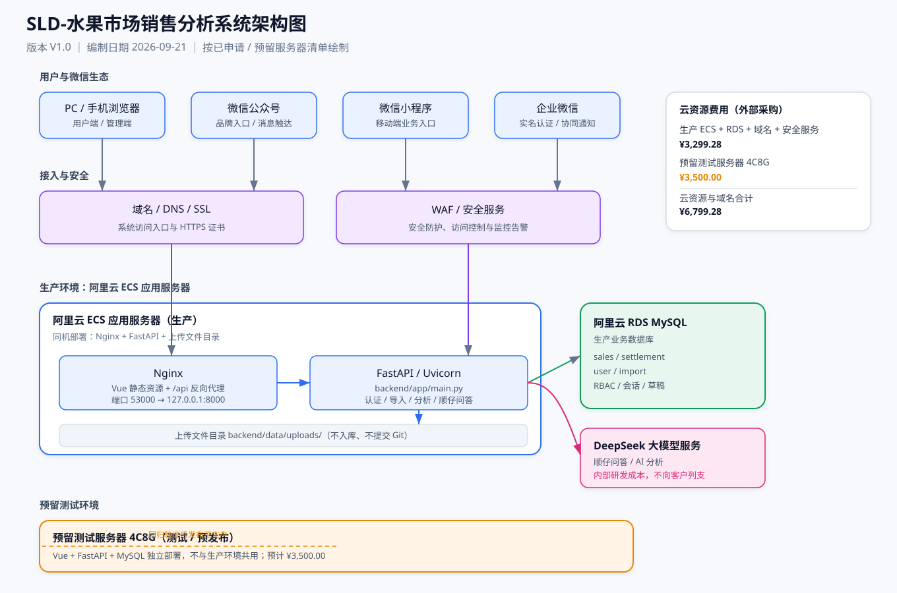

# SLD-水果市场销售分析系统架构图

文档版本：V1.0  |  编制日期：2026-09-21

本图按已申请 / 预留的服务器清单绘制，用于报价与交付说明。

## 架构图



## 可编辑 Mermaid 源

```mermaid
flowchart LR
    subgraph 用户与微信生态["用户与微信生态"]
        U1["PC / 手机浏览器"]
        U2["微信公众号"]
        U3["微信小程序"]
        U4["企业微信"]
    end

    subgraph 接入与安全["接入与安全"]
        D["域名 / DNS / SSL"]
        W["WAF / 安全服务"]
    end

    subgraph 生产环境["阿里云 ECS 应用服务器（生产）"]
        N["Nginx\nVue 静态资源 + /api 反向代理"]
        F["FastAPI / Uvicorn\nbackend/app/main.py"]
        FS["上传文件目录\nbackend/data/uploads/"]
    end

    subgraph 数据["阿里云 RDS MySQL（生产）"]
        DB["业务数据库\nsales / settlement / user / import"]
    end

    subgraph AI["AI 能力"]
        AI["DeepSeek 大模型服务\n（内部研发成本，不向客户列支）"]
    end

    subgraph 测试环境["预留测试服务器 4C8G（预计 ¥3,500）"]
        T["测试 / 预发布环境\nVue + FastAPI + MySQL 独立部署"]
    end

    U1 --> D
    U2 --> D
    U3 --> D
    U4 --> D
    D --> W
    W --> N
    N --> F
    F --> DB
    F --> FS
    F <--> AI
    T -.-> |回归验证后发布| N
```

## 费用口径

- 生产云资源：ECS + RDS MySQL + 域名 + 安全服务，台账合计 ¥3,299.28。
- 预留测试服务器：4C8G，预计 ¥3,500.00。
- 云资源与域名合计：¥6,799.28。
- 微信生态与企业微信认证：微信公众号 ¥300 + 微信小程序 ¥300 + 企业微信实名认证 ¥300。
- DeepSeek 大模型开发 / 调用成本为内部研发成本，不列入客户报价。
